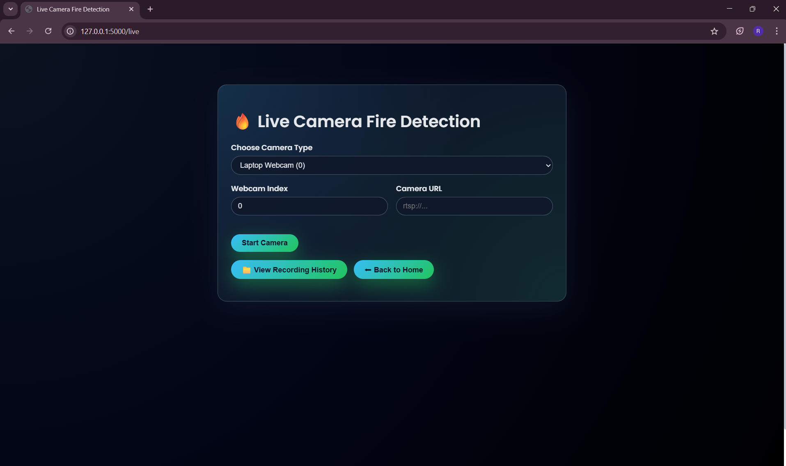
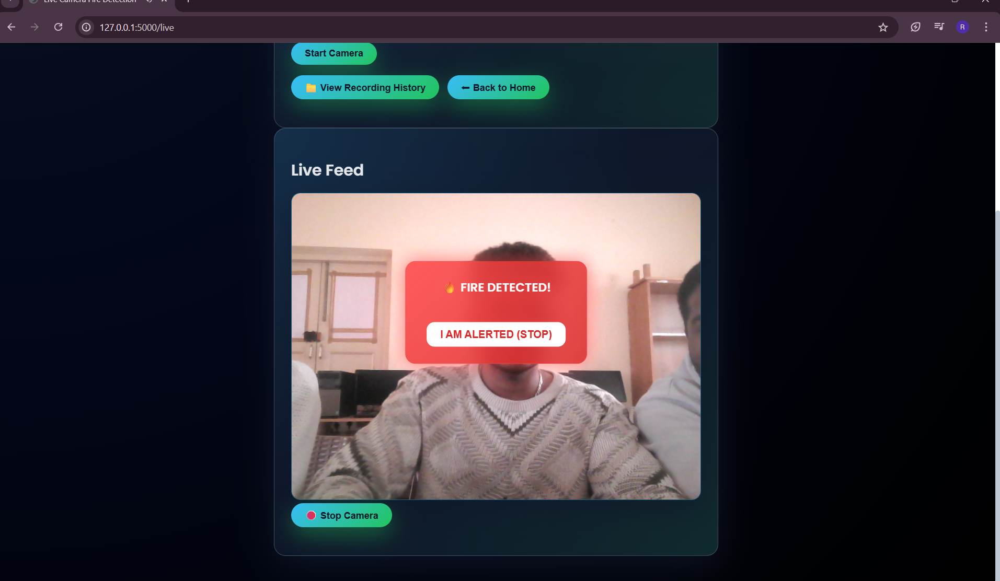
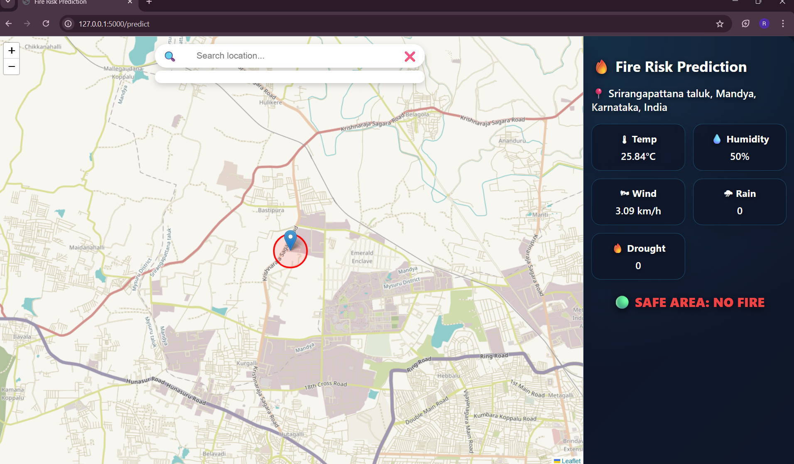
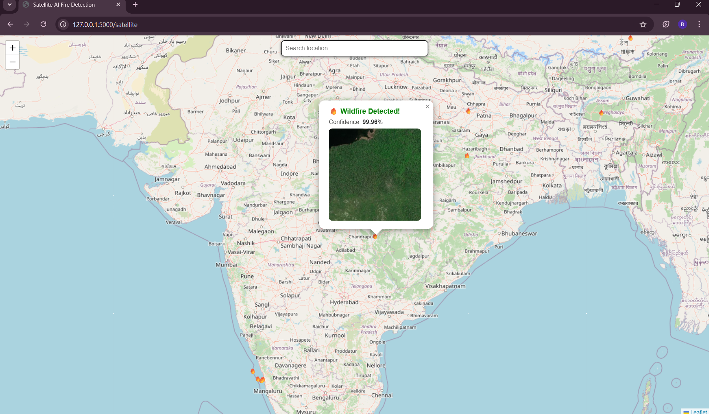
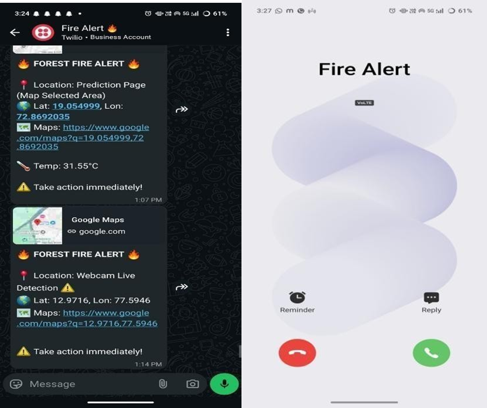

# 🌲🔥 ForestGuard-AI

### Intelligent Forest Fire Detection and Prediction System

## 📌 Overview

ForestGuard-AI is an AI-powered Forest Fire Detection and Prediction System designed to provide early detection, prediction, and monitoring of forest fires using Machine Learning, Computer Vision, and Weather Analysis. The system aims to reduce wildfire damage by providing real-time monitoring and alerts.

---

## 🚀 Key Features

* 🔥 **Live Webcam Fire Detection**
* 🖼️ **Fire Detection from Uploaded Images**
* 🎥 **Video-Based Fire Detection**
* 🌡️ **Weather-Based Forest Fire Prediction**
* 🛰️ **Satellite Image Analysis**
* 📍 **Interactive Map Monitoring**
* 📞 **Twilio Call & WhatsApp Alerts**
* 📊 **Detection History Dashboard**
* ⚡ **Real-Time Monitoring and Predictions**

---

## 🛠️ Technologies Used

| Category         | Technologies                |
| ---------------- | --------------------------- |
| Backend          | Python, Flask               |
| Machine Learning | TensorFlow, Scikit-Learn    |
| Computer Vision  | OpenCV                      |
| Frontend         | HTML, CSS, JavaScript       |
| APIs             | OpenWeather API, Twilio API |
| Mapping          | Leaflet.js                  |
| Database         | MongoDB                     |

---

## 🏗️ System Architecture

```text
User Input
     │
     ▼
Flask Web Application
     │
     ├── Fire Detection Module (OpenCV + ML)
     ├── Prediction Module (Weather Analysis)
     ├── Satellite Monitoring Module
     ├── Alert System (Twilio)
     └── Dashboard & History
```

---

## 📂 Project Structure

```text
ForestGuard-AI/
│
├── app.py
├── database/
├── detection/
├── prediction/
├── static/
├── templates/
├── models/
├── requirements.txt
└── README.md
```

---

## ⚙️ Installation

### Clone the Repository

```bash
git clone https://github.com/riteesh2566-lang/ForestGuard-AI.git
cd ForestGuard-AI
```

### Create Virtual Environment

```bash
python -m venv .venv
```

### Activate Environment

**Windows**

```bash
.venv\Scripts\activate
```

**Linux/Mac**

```bash
source .venv/bin/activate
```

### Install Dependencies

```bash
pip install -r requirements.txt
```

### Run the Application

```bash
python app.py
```

---

## 📥 Model Download

The trained model file is not included in this repository because it exceeds GitHub's file size limit.

### Download Model

🔗 **Google Drive:** [Download satellite_fire_model.h5](https://drive.google.com/file/d/1sgfTDqEi1lxpFZNF7w6GNR1CLlC2Ecij/view?usp=drive_link)

After downloading, place the file in the following directory:

```text
models/satellite_fire_model.h5
```

## Running the Project

```bash
python app.py
```


---

## 🎯 Future Enhancements

* Integration with real-time satellite data
* Mobile application support
* Email and SMS alerts
* Advanced Deep Learning models
* Multi-region wildfire prediction
* Cloud deployment and scalability

---

## 📸 Screenshots


### 🏠 Home Page


### 📊 Webcam Page


### 🔥 Live Fire Detection


### 🌡️ Wheather Prediction


### 🛰️ Satellite Monitoring


### 📊 MessageAlert


---

## 👨‍💻 Author

**Riteesh S**

🎓 MCA Student | AI & Data Science Enthusiast

📧 Email: [riteesh2566@gmail.com](mailto:riteesh2566@gmail.com)

🔗 GitHub: https://github.com/riteesh2566-lang

---

## ⭐ If you found this project useful, please consider giving it a star!

